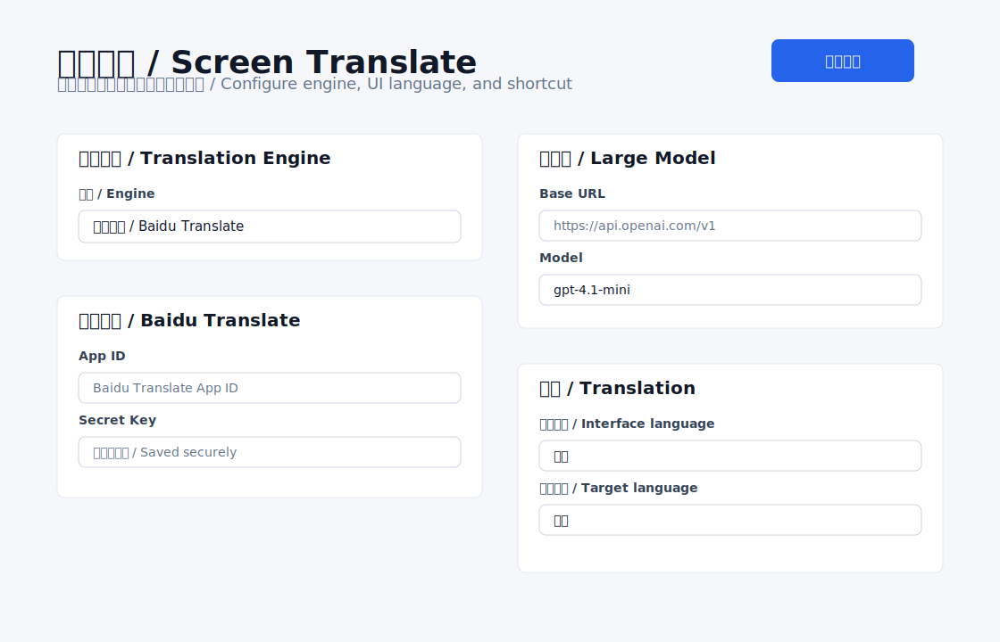
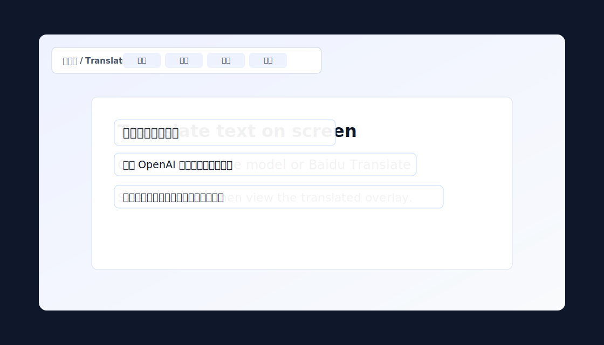
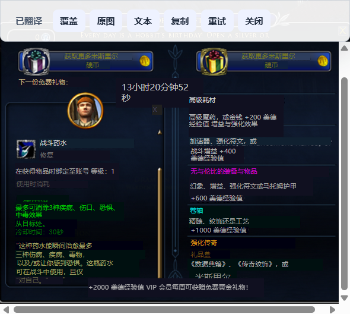

# Screen Translate / 屏幕翻译

Windows-first desktop screenshot translation client built with Electron, React, and TypeScript.

Screen Translate is a tray-based desktop tool for translating text directly from the screen. Press a global shortcut, select a region, and the app will OCR the captured area, translate the recognized text, and display the result as an overlay, original image, or text panel.It can quickly translate games that do not have Chinese.

屏幕翻译是一个面向 Windows 的桌面截图翻译工具。按下全局快捷键后选择屏幕区域，应用会对截图进行本地 OCR，再使用所选翻译引擎翻译识别文本，并以覆盖层、原图或文本面板展示结果。可以对于没有中文的游戏快速进行翻译。

## Screenshots / 截图





### Translation Example / 翻译效果

Original screenshot / 原始截图：


Translated result / 翻译结果：



## Features / 功能

- Global screenshot shortcut, default `Ctrl+Alt+T`.
- Multi-monitor region selection overlay.
- Local OCR before translation, with Windows OCR and PaddleOCR options.
- Translation engine switch: OpenAI-compatible large model or Baidu Translate.
- Configurable large-model `Base URL`, `Model`, and API key.
- Configurable Baidu Translate `App ID` and `Secret Key`.
- Bilingual UI: Chinese and English interface switching.
- Result window with overlay view, original screenshot view, text view, copy, retry, and close.
- Secure key storage through Electron `safeStorage`.
- History is disabled by default, with optional local screenshot and JSON history.

- 全局截图快捷键，默认 `Ctrl+Alt+T`。
- 支持多屏幕区域选择。
- 翻译前使用本地 OCR 识别截图文字，可选择 Windows OCR 或 PaddleOCR。
- 翻译引擎可切换：OpenAI 兼容大模型或百度翻译。
- 可配置大模型 `Base URL`、`Model` 和 API Key。
- 可配置百度翻译 `App ID` 和 `Secret Key`。
- 支持中英文界面切换。
- 结果窗口支持覆盖层、原图、文本、复制、重试和关闭。
- 使用 Electron `safeStorage` 安全保存密钥。
- 历史记录默认关闭，可选择在本地保存截图和 JSON 结果。

## How It Works / 工作流程

1. Press the shortcut or choose screenshot translation from the tray menu.
2. Drag to select a screen region.
3. The app captures the selected region and runs the selected local OCR engine.
4. Recognized text is sent to the selected translation service.
5. Translation results are rendered over the screenshot or shown as plain text.

1. 按下快捷键，或从托盘菜单启动截图翻译。
2. 拖拽选择屏幕区域。
3. 应用截取选区，并调用所选本地 OCR 引擎。
4. 识别出的文本会发送到所选翻译服务。
5. 翻译结果会覆盖显示在截图上，也可以切换到纯文本查看。

## Run / 运行

```bash
npm install
npm run dev
```

## Validate / 验证

```bash
npm run typecheck
npm test
npm run build
```

## Configuration / 配置

Open settings from the tray window and choose a translation engine:

- `OCR engine`: choose Windows default OCR or PaddleOCR. PaddleOCR uses the local API URL, default `http://127.0.0.1:8866`.
- `Large model`: configure an OpenAI-compatible `Base URL`, `API Key`, and `Model`.
- `Baidu Translate`: configure Baidu Translate `App ID` and `Secret Key`.
- `Target language`: controls the output translation language.
- `Interface language`: controls app UI language only.

在设置窗口中选择翻译引擎：

- `OCR 引擎`：选择 Windows 默认 OCR 或 PaddleOCR。PaddleOCR 使用本地 API 地址，默认 `http://127.0.0.1:8866`。
- `大模型`：配置 OpenAI 兼容的 `Base URL`、`API Key` 和 `Model`。
- `百度翻译`：配置百度翻译 `App ID` 和 `Secret Key`。
- `目标语言`：控制截图文字翻译成什么语言。
- `界面语言`：只控制应用界面显示语言。

## Privacy / 隐私

Screenshots are processed with the selected local OCR engine. Recognized text is sent to the selected translation service. Screenshots and translation history are not saved unless history is enabled in settings.

截图会先通过所选本地 OCR 引擎处理。识别出的文字会发送到所选翻译服务。除非在设置中启用历史记录，否则不会保存截图和翻译历史。

## Notes / 说明

The app can run without an API key. In that case, it falls back to mock translated blocks so the desktop flow can still be tested.

The first implementation targets Windows. Multi-monitor and high-DPI handling should still be tested on real hardware before packaging.

应用可以在未配置 API Key 的情况下运行，此时会使用模拟翻译结果，便于测试桌面流程。

当前版本优先支持 Windows。正式打包前仍建议在真实多屏和高 DPI 设备上测试。
